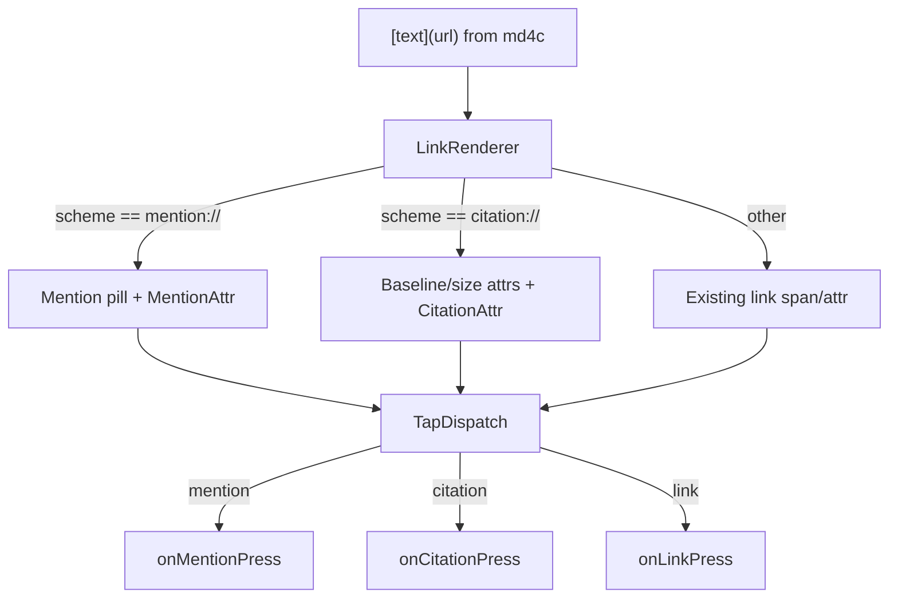

## Approach

Keep the standard CommonMark link syntax `[text](url)`. Dispatch at the renderer layer based on the URL scheme:

- `mention://<id>` → inline pill attachment (carries `userId`)
- `citation://<url>` → superscript/smaller-font inline marker (carries the underlying `url`)
- anything else → existing link behavior (unchanged)

No md4c or AST changes. Scope is **read-only renderer only** (`EnrichedMarkdownText` + the GFM-flavored `EnrichedMarkdownNativeComponent`); the input editor is unchanged. Press events are delivered through new `onMentionPress` / `onCitationPress` callbacks; existing `onLinkPress` stays unchanged for other schemes. No tooltips/popovers in this PR.

## Public API

New JS types and props (both native components: `EnrichedMarkdownTextNativeComponent` and `EnrichedMarkdownNativeComponent`):

```ts
interface MentionPressEvent { userId: string; text: string; }
interface CitationPressEvent { url: string; text: string; }

interface MentionStyle {
  color?: string;
  backgroundColor?: string;
  borderColor?: string;
  borderWidth?: number;
  borderRadius?: number;
  paddingHorizontal?: number;
  paddingVertical?: number;
  fontFamily?: string;
  fontWeight?: string;
  fontSize?: number;
  pressedOpacity?: number; // native tap feedback, default 0.6
}

interface CitationStyle {
  color?: string;
  fontSizeMultiplier?: number; // default 0.7
  baselineOffsetPx?: number;   // explicit px; default derived from font metrics for iOS/Android parity
  fontWeight?: string;
  underline?: boolean;
  backgroundColor?: string;
}
```

Added to [`src/types/MarkdownStyle.ts`](src/types/MarkdownStyle.ts) as `mention?: MentionStyle; citation?: CitationStyle;`, mirrored as internal shapes in [`src/EnrichedMarkdownTextNativeComponent.ts`](src/EnrichedMarkdownTextNativeComponent.ts) and [`src/EnrichedMarkdownNativeComponent.ts`](src/EnrichedMarkdownNativeComponent.ts), defaulted in [`src/normalizeMarkdownStyle.ts`](src/normalizeMarkdownStyle.ts), and re-exported from [`src/index.tsx`](src/index.tsx).

## Dispatch flow



## iOS

- Extend [`ios/styles/StyleConfig.h`](ios/styles/StyleConfig.h)/`.mm` with getters/setters for the new `mention*` and `citation*` fields, wired from `StylePropsUtils`.
- Refactor [`ios/renderer/LinkRenderer.m`](ios/renderer/LinkRenderer.m): after child rendering, inspect the URL prefix and branch:
  - `mention://`: replace the text range with an `NSAttributedString` containing an `NSAttachmentCharacter` backed by a new `ENRMMentionAttachment` (subclass of `NSTextAttachment`) providing an `NSTextAttachmentViewProvider` that renders a rounded, padded `UILabel`/`UIView` pill via Auto Layout. Tag the range with new attributes `ENRMMentionUserId` + `ENRMMentionText`. The podspec uses `min_ios_version_supported` (≥ iOS 15.1 on current RN), so no pre-iOS-15 `drawInRect:` fallback is needed — commit to the view-provider path only.
  - `citation://`: keep text, apply `NSBaselineOffsetAttributeName` (explicit px from `baselineOffsetPx`, or derived from current font metrics) + a smaller font derived from the current font × `fontSizeMultiplier`, optional `NSBackgroundColorAttributeName`. Tag range with `ENRMCitationUrl` + `ENRMCitationText`.
  - default: unchanged path (`NSLinkAttributeName` + `linkURL` + existing underline/color).
- `ENRMMentionAttachment`'s view provider installs a `UITapGestureRecognizer` and a `touchesBegan`/`touchesCancelled` animator that applies `mention.pressedOpacity` on press-in and restores on press-out, matching the native "shrink/fade on tap" expectation.
- Update [`ios/utils/LinkTapUtils.m`](ios/utils/LinkTapUtils.m) to also read `ENRMMentionUserId` and `ENRMCitationUrl` when determining the tapped element type, and `isPointOnInteractiveElement` to treat mention/citation as interactive.
- In [`ios/EnrichedMarkdownText.mm`](ios/EnrichedMarkdownText.mm) tap handler, fire one of three event emitters based on which attribute is present (`onMentionPress` / `onCitationPress` / existing `onLinkPress`). Same treatment in `EnrichedMarkdown.mm` (GFM flavor).

## Android

- Add `MentionStyle.kt` / `CitationStyle.kt` data classes alongside existing style configs, wired through the prop converters in [`EnrichedMarkdownTextManager.kt`](android/src/main/java/com/swmansion/enriched/markdown/EnrichedMarkdownTextManager.kt).
- Add `MentionSpan.kt` (extends `ReplacementSpan`) that overrides `getSize` and `draw` to paint the rounded background, optional border, padding, and the name text. `getSize` must explicitly add `2 * paddingHorizontal + 2 * borderWidth` to the measured text width so the pill doesn't clip, and return a descent/ascent that accounts for `paddingVertical` + `borderWidth`. Holds `userId` + display `text`. Applies `pressedOpacity` to the `Paint` alpha while `isPressed` is true; pressed state is toggled by the link tap dispatcher below.
- Add `CitationSpan.kt` — a custom `SuperscriptSpan` subclass that accepts an explicit `baselineOffsetPx` in `updateDrawState` / `updateMeasureState`, combined with `RelativeSizeSpan(citationStyle.fontSizeMultiplier)` and optional `ForegroundColorSpan` / `BackgroundColorSpan` applied in the same `setSpan` call. The explicit baseline offset gives exact parity with iOS's `NSBaselineOffsetAttributeName` and sidesteps OEM-dependent quirks in the framework's default `SuperscriptSpan`. Holds `url` + `text`.
- Update [`android/src/main/java/com/swmansion/enriched/markdown/renderer/LinkRenderer.kt`](android/src/main/java/com/swmansion/enriched/markdown/renderer/LinkRenderer.kt) to branch on `url.startsWith("mention://")` / `"citation://"` and install the appropriate span instead of `LinkSpan`. Legacy `LinkSpan` is untouched.
- Event wiring: in [`EnrichedMarkdownText.kt`](android/src/main/java/com/swmansion/enriched/markdown/EnrichedMarkdownText.kt) tap path (currently dispatching `LinkPressEvent`), use the span type at the tap index to dispatch `MentionPressEvent` / `CitationPressEvent` instead. Add new event classes under [`events/`](android/src/main/java/com/swmansion/enriched/markdown/events/) mirroring `LinkPressEvent`. On `ACTION_DOWN` over a `MentionSpan`, toggle the span's `isPressed` flag and invalidate the view; reset on `ACTION_UP`/`ACTION_CANCEL`.

## Web

Same scheme-based branching happens in [`src/web/renderers/InlineRenderers.tsx`](src/web/renderers/InlineRenderers.tsx)'s `LinkRenderer`:

- `mention://<userId>` → `<span role="button" class="enriched-mention" onClick={...}>` styled as an inline-flex pill using `styles.mention` (backgroundColor, borderColor/Width, borderRadius, padding, color, font). `pressedOpacity` maps to a CSS `:active { opacity: ... }` rule injected once at mount (via a style tag keyed by a className, similar to how existing web renderers handle hover states) — CSS does the tap-feedback automatically, no JS state needed.
- `citation://<url>` → `<sup class="enriched-citation" onClick={...}>` with `styles.citation` (color, `fontSize: calc(1em * fontSizeMultiplier)`, `verticalAlign: baseline` + `top: -baselineOffsetPx`, optional background, optional underline via `textDecoration`). Kept in a `<sup>` tag so screen readers announce it as superscript.
- default: unchanged `<a href>` path.

Supporting updates:

- [`src/web/types.ts`](src/web/types.ts): extend `RendererCallbacks` with `onMentionPress` / `onCitationPress`.
- [`src/types/MarkdownTextProps.web.ts`](src/types/MarkdownTextProps.web.ts): add the two new callbacks alongside the existing `onLinkPress` / `onLinkLongPress`, documented `@platform ios, android, web`.
- [`src/web/EnrichedMarkdownText.tsx`](src/web/EnrichedMarkdownText.tsx): thread the new callbacks into the render context.
- [`src/web/styles.ts`](src/web/styles.ts): add `mention` and `citation` entries to the `Styles` map, normalized from `MarkdownStyleInternal.mention` / `.citation`.
- [`src/index.web.tsx`](src/index.web.tsx): re-export `MentionPressEvent` / `CitationPressEvent` / `MentionStyle` / `CitationStyle`.

## Things explicitly out of scope

- Parser/AST changes (still pure md4c).
- Editor support (`EnrichedMarkdownInput`) — no `insertMention`/`insertCitation` yet.
- Built-in popover/tooltip UI on any platform.