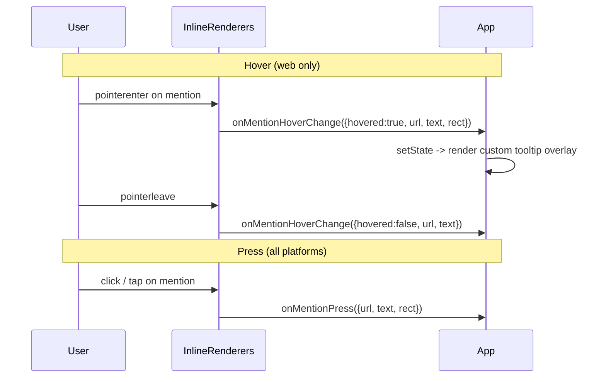

## Goal

- Web: emit hover-in / hover-out events with the hovered pill's viewport coordinates so consumers can render their own tooltip.
- All platforms: add an optional `rect` field to the existing `onMentionPress` / `onCitationPress` events. No new long-press events, no gesture changes on mobile.

## Public API

### Event types — [src/types/events.ts](src/types/events.ts)

```ts
export interface InlineElementRect {
  /**
   * Web: viewport-relative (from getBoundingClientRect()).
   * iOS / Android: container-relative (origin is the EnrichedMarkdownText view).
   */
  x: number;
  y: number;
  width: number;
  height: number;
}

export interface MentionPressEvent {
  url: string;
  text: string;
  /** Pill bounding rect at press time. Present on all platforms. */
  rect?: InlineElementRect;
}

export interface CitationPressEvent {
  url: string;
  text: string;
  rect?: InlineElementRect;
}

export interface MentionHoverEvent {
  url: string;
  text: string;
  hovered: boolean;
  /** Present when hovered === true; omitted on hover-out. */
  rect?: InlineElementRect;
}

export interface CitationHoverEvent {
  url: string;
  text: string;
  hovered: boolean;
  rect?: InlineElementRect;
}
```

`rect` is optional to preserve back-compat (future platforms / edge cases where we can't compute it can omit it).

### New props — [src/types/MarkdownTextProps.web.ts](src/types/MarkdownTextProps.web.ts)

```ts
onMentionHoverChange?: (event: MentionHoverEvent) => void;
onCitationHoverChange?: (event: CitationHoverEvent) => void;
```

Single event with `hovered: boolean` rather than two separate in/out events so consumers can drive a `useState` with one handler and avoid stale-state races.

## Web implementation (this pass)

Files touched:

- [src/types/events.ts](src/types/events.ts): add `InlineElementRect`, extend `MentionPressEvent` / `CitationPressEvent` with `rect`, add `MentionHoverEvent` / `CitationHoverEvent`.
- [src/types/MarkdownTextProps.web.ts](src/types/MarkdownTextProps.web.ts): add `onMentionHoverChange`, `onCitationHoverChange`.
- [src/types/MarkdownTextProps.ts](src/types/MarkdownTextProps.ts): no new props (native keeps same two press callbacks), but imports updated event types automatically.
- [src/web/types.ts](src/web/types.ts): add `onMentionHoverChange` / `onCitationHoverChange` to `RendererCallbacks`.
- [src/web/EnrichedMarkdownText.tsx](src/web/EnrichedMarkdownText.tsx): accept + memoize the two new props into `callbacks`.
- [src/web/renderers/InlineRenderers.tsx](src/web/renderers/InlineRenderers.tsx): wire pointer / focus handlers on mention `<span>` and citation `<sup>`; include `rect` on click handlers.

### Renderer change (sketch)

```tsx
function MentionRenderer({ url, callbacks, node, styles }: SchemeRendererProps) {
  const mentionUrl = url.slice(MENTION_SCHEME.length);
  const displayText = extractNodeText(node);

  const rectFromEvent = (
    event: { currentTarget: { getBoundingClientRect: () => InlineElementRect } }
  ): InlineElementRect => {
    const r = event.currentTarget.getBoundingClientRect();
    return { x: r.x, y: r.y, width: r.width, height: r.height };
  };

  const handleClick = (event: MouseEvent) => {
    event.preventDefault();
    callbacks.onMentionPress?.({
      url: mentionUrl,
      text: displayText,
      rect: rectFromEvent(event),
    });
  };

  const handleHoverIn = (event: PointerEvent | FocusEvent) => {
    callbacks.onMentionHoverChange?.({
      url: mentionUrl,
      text: displayText,
      hovered: true,
      rect: rectFromEvent(event),
    });
  };

  const handleHoverOut = () => {
    callbacks.onMentionHoverChange?.({
      url: mentionUrl,
      text: displayText,
      hovered: false,
    });
  };

  // ... existing pressed-opacity style unchanged ...

  return (
    <>
      <style>{MENTION_PRESSED_STYLE_RULE}</style>
      <span
        className={MENTION_CLASS}
        role="button"
        tabIndex={0}
        onPointerEnter={handleHoverIn}
        onPointerLeave={handleHoverOut}
        onFocus={handleHoverIn}
        onBlur={handleHoverOut}
        onClick={handleClick}
        style={style}
      >
        {displayText}
      </span>
    </>
  );
}
```

Citations get the same rect-on-click + hover handlers on `<sup>`.

### Semantics

- `rect` on web is viewport-coordinates (`getBoundingClientRect()`), captured once at event emission time.
- Hover-in fires on `pointerenter` and `focus` (keyboard a11y). Hover-out fires on `pointerleave` and `blur`.
- No debounce / delay in the library — consumers add `setTimeout` if they want a hover delay.
- Existing click → `onMentionPress` / `onCitationPress` behavior is unchanged except the payload now carries `rect`.

### Scroll behavior (documented, not handled)

The library emits `rect` once per event — it does not re-emit on scroll or resize. If the page scrolls (or an ancestor scroll container scrolls) while a tooltip is open, the stored viewport rect goes stale and the tooltip will visually detach from the pill.

Recommended consumer patterns, listed from simplest to most robust, go into the JSDoc for `onMentionHoverChange` / `onCitationHoverChange`:

1. **Dismiss on scroll.** Listen to `scroll` on `window` (capture) while hovered and clear tooltip state. Simplest and most common tooltip UX.
2. **Re-measure on scroll.** Keep the mention id in state on hover-in, and re-query the DOM (`document.querySelector(` `` `[data-mention-url="${url}"]` `` `)`) on scroll to refresh position. Works because `InlineRenderers` already stamps `data-mention-url` / `data-citation-url` on the element.
3. **Upgrade to a ref-based lib.** If live repositioning matters, a future iteration of this plan can add an optional `target: HTMLElement` field to the web hover event without breaking back-compat. Out of scope here.

Same story on native: `rect` is emitted once, and if the user scrolls the surrounding RN `ScrollView` the consumer is responsible for dismissing or re-emitting (typically wired to the `ScrollView`'s `onScroll`). This library does not own the scroll container and has no API for it.

## Native plan (documented, not implemented)

Only one change needed on each platform: include `rect` in the existing press event. No new gestures, no new callbacks.

iOS ([ios/utils/LinkTapUtils.m](ios/utils/LinkTapUtils.m), [ios/EnrichedMarkdownText.mm](ios/EnrichedMarkdownText.mm)):

- At the point `inlineElementAtTapLocation` resolves a mention or citation, compute the full attribute run's character range (`effectiveRange:` out-param from `attributesAtIndex:`), then call `NSLayoutManager boundingRectForGlyphRange:inTextContainer:` for that glyph range.
- Combine with `lineFragmentRectForGlyphAtIndex:` for the hit glyph when the run is multi-line, so line-height and padding are accounted for correctly (not just the glyph ink extent).
- Convert to the `EnrichedMarkdownText` view's coordinate space by adding the text container inset / the host view's `bounds.origin` offset as used elsewhere in this file.
- Include the rect on the `MentionPressEvent` / `CitationPressEvent` payload emitted from `EnrichedMarkdownText.mm`.

Android ([android/.../spans/MentionSpan.kt](android/src/main/java/com/swmansion/enriched/markdown/spans/MentionSpan.kt), [android/.../spans/CitationSpan.kt](android/src/main/java/com/swmansion/enriched/markdown/spans/CitationSpan.kt), [android/.../utils/text/view/LinkLongPressMovementMethod.kt](android/src/main/java/com/swmansion/enriched/markdown/utils/text/view/LinkLongPressMovementMethod.kt)):

- In `LinkLongPressMovementMethod.onTouchEvent` where `onMentionTap` / `onCitationTap` currently fire, compute the span's rect from `Layout.getPrimaryHorizontal(spanStart..spanEnd)` + `Layout.getLineTop` / `getLineBottom` for the hit line.
- `Layout` coordinates are text-relative, not view-relative. Before emitting, add `textView.totalPaddingLeft` to x and `textView.totalPaddingTop` to y so the rect is aligned with the `EnrichedMarkdownText` View's origin.
- Thread the rect through `MentionPressEvent.kt` / `CitationPressEvent.kt` to the JS event.

Both platforms report **container-relative** rects (relative to the `EnrichedMarkdownText` view), documented on `InlineElementRect`.

Since this only extends an existing optional field, it is fully backward-compatible: consumers already reading `url` / `text` see no changes.

Hover events on native are explicitly out of scope — mobile has no hover.

### Consumer guidance on native (to include in JSDoc for `rect`)

Most RN positioning libraries (e.g. `@floating-ui/react-native`) expect window / global coordinates, not container-relative ones. To convert:

```tsx
const ref = useRef<View>(null);
const [containerOrigin, setContainerOrigin] = useState({ x: 0, y: 0 });

<EnrichedMarkdownText
  ref={ref}
  onLayout={() => {
    ref.current?.measureInWindow((x, y) => setContainerOrigin({ x, y }));
  }}
  onMentionPress={({ url, text, rect }) => {
    const windowRect = rect && {
      x: rect.x + containerOrigin.x,
      y: rect.y + containerOrigin.y,
      width: rect.width,
      height: rect.height,
    };
    // feed windowRect to Floating UI / custom overlay
  }}
/>
```

Rationale for keeping the emitted rect container-relative rather than global: the component itself may move (animated transitions, keyboard avoidance, parent re-layout), and a container-relative rect remains valid as long as the consumer re-measures the container on layout changes.

## Flow diagram



## Out of scope

- No long-press events for mention / citation on mobile.
- No tooltip UI shipped with the library — consumers own all rendering / positioning / a11y.
- No markdown syntax changes; no new `MarkdownStyle` slots.

## Risks / notes

- Multi-line mention wraps: `getBoundingClientRect()` returns the bounding box across all line fragments on web (one tall rect spanning both lines); native equivalents collapse to the hit line. Documented platform asymmetry. If this becomes visually jarring, a future iteration can switch the web rect to `event.currentTarget.getClientRects()[hitLineIndex]` to anchor to the specific hovered line — non-breaking since `InlineElementRect` shape stays the same.
- Rect is optional on both press and hover event types. Consumers must null-check before using it.
- Rect is a point-in-time snapshot. The library does not track the pill through scrolls / resizes; handling that is the consumer's responsibility (see "Scroll behavior" above). Deliberate choice to keep the API thin and uniform across platforms.

## Future considerations (not in this pass)

- **`target: HTMLElement` field on web hover event.** Enables live re-positioning with Floating UI / Popper on scroll/resize without consumer re-querying DOM. Additive, non-breaking.
- **`padding` or `inset` in `InlineElementRect`.** If consumers want the rect slightly expanded (e.g. to allow a fade/slide tooltip entry animation without visual jitter at the edges), a numeric padding can be added to the event payload later. Out of scope for v1 — consumers can expand the rect themselves.
- **Per-line-fragment rect on web** for long multi-line mention wraps (see Risks above).
